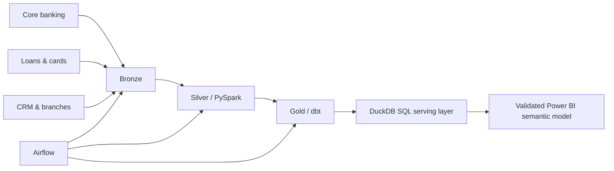

# FinTrust Banking Intelligence Platform

An end-to-end, synthetic retail-banking analytics platform designed to answer a bank leadership team's hardest recurring questions: where profit is created, which loans are deteriorating, which customers are likely to leave, where suspicious transaction patterns are emerging, and which branches need intervention.

> Portfolio disclosure: FinTrust is fictional. All customers, accounts, transactions and outcomes are deterministically generated; no real personal or financial data is used.

## Why this project is different

This is not a single CSV connected to a dashboard. It models five operational source domains, preserves event-level grain, applies data-quality controls, builds a dimensional warehouse, and exposes management-ready metrics through a governed semantic layer.

## Architecture



The executed local implementation uses an ADLS-style lake layout, genuine Delta tables, PySpark, dbt and DuckDB. Azure ADLS and Databricks deployment are documented as credential-blocked rather than presented as live cloud infrastructure.

## Two complementary analytics layers

**Business analytics:** SQL, Python, Power BI, customer analytics, transactions, fraud, credit risk, churn and branch performance.

**Modern analytics engineering:** locally executed Azure-style data lake, PySpark 4, Delta Lake medallion processing, dbt dimensional models and tests, an Airflow DAG, DuckDB serving, incremental checkpoints, quality gates and JSONL monitoring. See [`documentation/TIER3_EXECUTION_EVIDENCE.md`](documentation/TIER3_EXECUTION_EVIDENCE.md) for claim-by-claim evidence.

## Business scope

- Executive profitability and customer growth
- Deposit portfolio and digital adoption
- Loan delinquency, exposure and expected-loss proxies
- Card utilization and transaction risk signals
- Customer churn propensity and value segmentation
- Branch productivity and service quality

## Repository map

| Path | Purpose |
|---|---|
| `src/generate_data.py` | Deterministic multi-table source-data generator |
| `src/validate_data.py` | Referential, domain and reconciliation checks |
| `sql/` | Warehouse DDL, transformations and business queries |
| `lakehouse/pipeline.py` | Executed incremental Bronze Delta and PySpark Silver pipeline |
| `dbt/fintrust/` | Staging, marts, tests and documentation |
| `airflow/dags/` | Idempotent daily orchestration DAG |
| `powerbi/` | Semantic model, measures, page specification and theme |
| `docs/` | Requirements, data dictionary, KPI catalogue and interview guide |
| `tests/` | Automated generator and data-quality tests |
| `documentation/` | Tier-3 evidence, lineage, Azure path and interview guide |

## Quick start

```bash
python -m venv .venv
# Windows: .venv\Scripts\activate
# macOS/Linux: source .venv/bin/activate
pip install -r requirements.txt
python src/generate_data.py --scale demo
python src/validate_data.py
pytest -q
```

Tier-3 local run on Windows requires Java 17 and Hadoop `winutils`; set `JAVA_HOME` and `HADOOP_HOME`, then run:

```bash
python lakehouse/pipeline.py run
cd dbt/fintrust
dbt build --profiles-dir .
dbt docs generate --profiles-dir .
cd ../..
python tools/tier3_validate.py --stage all
```

Generated data is written to `data/raw/`; validation outputs go to `data/quality/`. Large generated files are intentionally excluded from Git because they are reproducible.

## Dataset grains

| Dataset | Grain |
|---|---|
| customers | One row per customer |
| branches | One row per branch |
| accounts | One row per bank account |
| transactions | One row per posted transaction |
| loans | One row per originated loan |
| loan_payments | One row per scheduled loan instalment |
| cards | One row per payment card |
| interactions | One row per customer interaction |

## Core KPIs

- Net banking income proxy
- Assets under management proxy
- Deposit balance and CASA ratio
- Loan outstanding and portfolio yield
- 30+ DPD and 90+ DPD ratios
- Expected loss proxy
- Digital transaction share
- High-risk transaction rate
- Customer churn rate and at-risk value
- Branch cost-to-income proxy

Definitions, owners, grains and caveats are documented in [`docs/KPI_CATALOGUE.md`](docs/KPI_CATALOGUE.md).

## Power BI dashboard

The repository includes the editable PBIP source and a validated, portable PBIX with its imported semantic model:

- [`FinTrust_Banking_Intelligence_FINAL.pbix`](FinTrust_Banking_Intelligence_FINAL.pbix) - final six-page report
- [`FinTrust_Banking_Intelligence.pbip`](FinTrust_Banking_Intelligence.pbip) - editable developer project
- [`REPORT_GUIDE.md`](REPORT_GUIDE.md) - page intent, data grain, filter behavior and KPI interpretation
- [`validation/source_validation.json`](validation/source_validation.json) - reproducible KPI and model checks
- [`validation/DESKTOP_VALIDATION.md`](validation/DESKTOP_VALIDATION.md) - observed Desktop refresh, render and filter tests

The six decision pages are Executive Overview, Credit Risk & Collections, Deposits & Transactions, Fraud & Investigations, Customers & Digital, and Branch Performance. Common Period, Region, Branch and Customer Segment slicers synchronize across pages. The report uses the supplied synthetic source data and clearly separates current-state balances from month-end snapshots.

Validated unfiltered results include 5,000 customers, ₹522.38M latest deposit balance, ₹902.48M loan outstanding, 15.17% 30+ DPD exposure, 5.93% 90+ DPD exposure, 62.21% digital transaction share, 5.32% churn and 96.09% collection efficiency.

## Reproducibility and governance

- Fixed random seed and explicit scale profiles
- Synthetic PII only, with clear disclosure
- Primary-key, foreign-key, null, range and reconciliation checks
- Business logic separated from presentation logic
- No credentials, secrets or generated customer records committed
- Cloud components labeled as deployable reference implementations unless actually deployed

## Portfolio summary

Built a governed retail-banking analytics platform using Python, SQL, PySpark, Delta Lake, dbt, Airflow and Power BI design artifacts. Modeled customer, account, transaction, loan, card and service domains; implemented risk and profitability metrics; and added automated data-quality checks and cloud deployment guidance.

## Status

See [`PROJECT_STATUS.md`](PROJECT_STATUS.md) for the precise completion and deployment state.

