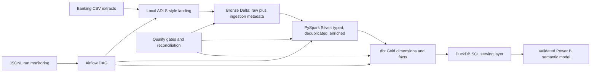

# FinTrust Lakehouse Lineage

| Output | Grain | Key | Purpose |
|---|---|---|---|
| Bronze transactions | Source transaction | `transaction_id` | Immutable source representation plus batch metadata |
| Silver transactions | Deduplicated transaction | `transaction_id` | Typed timestamp/date, year/month and risk band |
| `dim_customer` | Customer | `customer_id` | Customer, churn and engagement analysis |
| `dim_account` | Account | `account_id` | Account ownership and balance context |
| `fact_transactions` | Transaction | `transaction_id` | Channel, value, status and fraud-risk analysis |
| `fact_risk` | Loan | `loan_id` | Outstanding exposure and delinquency analysis |
| `fact_fraud` | Investigation case | `case_id` | Investigation outcomes and losses |
| `mart_channel_daily` | Date and channel | Composite | Power BI channel trend serving |

PySpark owns scalable cleaning and enrichment. dbt owns analytical modeling, relationships, tests and documentation. DuckDB is the locally executed substitute for Databricks SQL; its tables can be migrated to a Databricks SQL warehouse without changing the logical Gold model.
